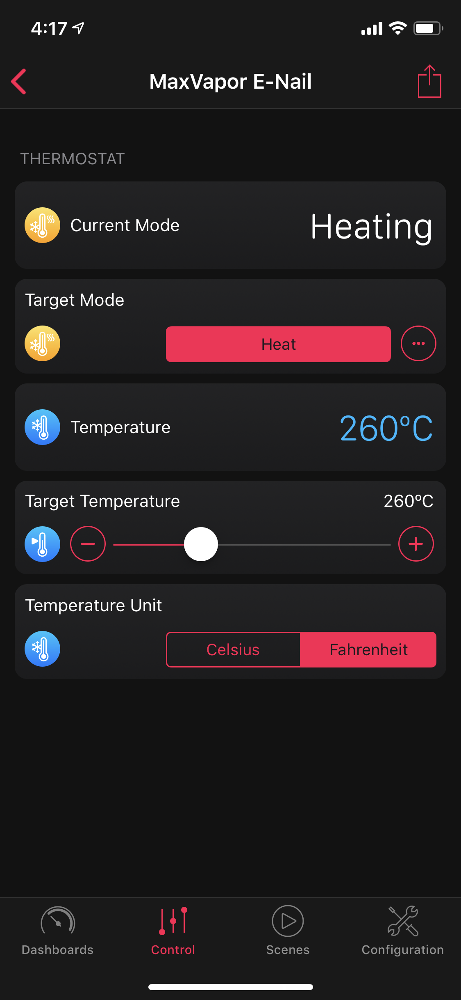

# homebridge-platform-maxvapor
A [MaxVapor E-Nail](https://maxvapor.com/) platform plugin for [Homebridge](https://github.com/nfarina/homebridge).

# Installation
Run these commands:

    % sudo npm install -g homebridge
    % sudo npm install -g homebridge-platform-maxvapor

If you install homebridge like this:

    sudo npm install -g --unsafe-perm homebridge

Then all subsequent installations must be like this:

    sudo npm install -g --unsafe-perm homebridge-platform-maxvapor

# Configuration
Edit `~/.homebridge/config.json`, inside `"platforms": [ ... ]` add:

	{
		"platform"	: "MaxVapor",
		"name"		: "homebridge-platform-maxvapor",
		"token"		: ""
	}

The `token` line must include a valid API Token from the MaxVapor Dashboard.

To obtain an API Token, please login to your existing MaxVapor Dashboard Account, select the `Data Logging` option from the sidebar and `Request a Token` or use one of the existing tokens displayed.

# HomeKit Appearance
Each MaxVapor E-Nail Controller will appear as an accessory that is a "thermostat". 

The Homebridge device name will correspond to the E-Nail Controller Name in the [Device List](https://dashboard.maxvapor.com/dashboard/devices/) of the MaxVapor Dashboard.

For example,
as shown in the [HomeDash App](https://www.homedash.app/):

Additional functionality may be added in the future through new services, such as the accelerometer being exposed as a "motion detector" accessory.

In addition,
the thermostat service will only respond to the `Off` and `Heat` modes, commands for `Auto` or `Cool` will be ignored by the device.

